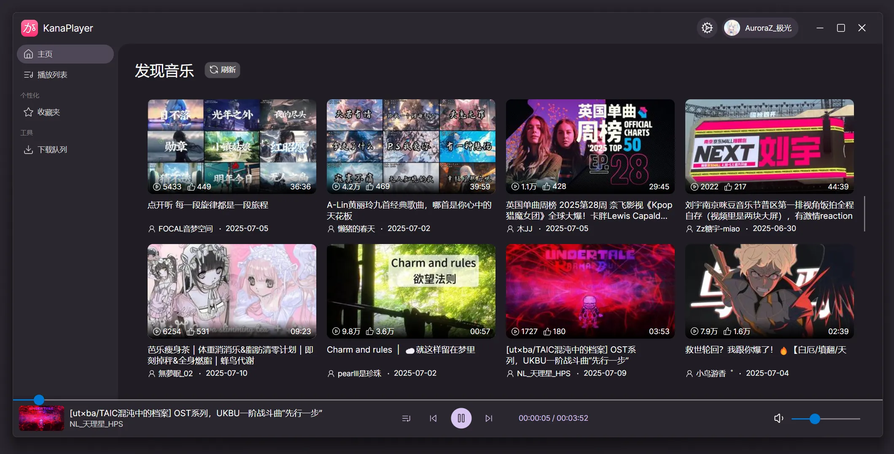

[//]: # ([![Contributors][contributors-shield]][contributors-url])
[//]: # ([![Forks][forks-shield]][forks-url])
[//]: # ([![Stargazers][stars-shield]][stars-url])
[//]: # ([![Issues][issues-shield]][issues-url])
[//]: # ([![Unlicense License][license-shield]][license-url])

---

KanaPlayer 正处于积极开发阶段，存在许多未完成的功能和可能的错误。

---

 

  

  <h2 align="center">KanaPlayer</h2>

  

    B站音频播放器
     
     
    <a href="https://github.com/AuroraZiling/KanaPlayer"><strong>帮助文档 (WIP) »</strong></a>
     
    <a href="https://github.com/AuroraZiling/KanaPlayer/issues/new?template=bug-report.md">错误报告</a>
    &middot;
    <a href="https://github.com/AuroraZiling/KanaPlayer/issues/new?template=feature-request.md">新功能请求</a>
  

## 关于 / About

KanaPlayer 是一个基于 Bilibili API 的音频播放器，旨在提供一个简洁易用的音频播放体验。

### 特性 / Features

- 音乐分区首页滚动推送
- 本地播放列表
- B站导入收藏夹 / 合集

[项目路线图与未来计划](.github/Roadmap.md)

*KanaPlayer 只会提供绿色的便携版本，所有的依赖都包含在内。*

### 技术栈 / Tech Stack

[![.NET 9][.NET 9]][.NET-url][![Avalonia][Avalonia]][Avalonia-url]

### 截图 / Screenshots

(<a href="#readme-top">回到顶部</a>)

## 开始使用 / Getting Started

**KanaPlayer 不会将您的任何信息上传到其他服务器，仅与Bilibili API交互，所有的数据都保存在本地。**

### 环境 / Environment

KanaPlayer 依赖 [.NET 9 桌面运行时](https://dotnet.microsoft.com/download/dotnet/9.0)，推荐安装。

如果不希望安装桌面运行时，可以下载 [Github Releases](https://github.com/AuroraZiling/KanaPlayer/releases) 中末尾为`-runtime`的包，它包含了所有的依赖和运行时。

### 安装与启动 / Installation & Launch

1. 在 [Github Releases](https://github.com/AuroraZiling/KanaPlayer/releases) 中找到最新版本
2. 下载对应的压缩包
   - 如果您已经安装了 [.NET 9 桌面运行时](https://dotnet.microsoft.com/download/dotnet/9.0)，可以下载 `KanaPlayer-x.x.x.zip` 包
   - 如果您不希望安装桌面运行时，可以下载 `KanaPlayer-x.x.x-runtime.zip` 包
3. 将压缩包解压在您希望的目录下
4. 双击 `KanaPlayer.exe` 启动即可

## 开发与贡献 / Development & Contribution

### 开发环境 / Development Environment

- KanaPlayer 基于 [.NET 9](https://dotnet.microsoft.com/download/dotnet/9.0) 和 [Avalonia](https://avaloniaui.net/) 开发
- 推荐使用 [Visual Studio 2022](https://visualstudio.microsoft.com/vs/) 或 [Rider](https://www.jetbrains.com/rider/)

### 贡献 / Contribute

感谢您对 KanaPlayer 的贡献

1. 开始之前，请遵循 [Code of Conduct](.github/CODE_OF_CONDUCT.md) 和 [Contributing Guidelines](.github/CONTRIBUTING.md)
2. Fork 本仓库
3. 创建您的分支 (`YourBranchName`)
4. PR 代码准备好后，推送到您的分支
5. 创建一个新的 [Pull Request](https://github.com/AuroraZiling/KanaPlayer/pulls) 至本仓库的 `main` 分支
6. 在 PR 中描述您的更改和目的
7. 等待审查和合并

### 主要贡献者 / Major Contributors

## 许可证 / License

KanaPlayer 使用 [MIT 许可证](LICENSE)

### 第三方库许可证 / Third-party Library Licenses

- **LibVLC** - [LGPL 2.1 许可证](https://github.com/videolan/vlc/blob/master/COPYING.LIB)
   - LibVLC 是 VideoLAN 项目的一部分
   - 项目主页：https://www.videolan.org/vlc/libvlc.html
   - 源代码：https://github.com/videolan/vlc

## 鸣谢 / Acknowledgements

- **[Dear.Va](https://github.com/DearVa)**
- [SocialSisterYi/bilibili-API-collect](https://github.com/SocialSisterYi/bilibili-API-collect)
- [kikipoulet/SukiUI](https://github.com/kikipoulet/SukiUI)
- [ymg2006/FluentAvalonia.ProgressRing](https://github.com/ymg2006/FluentAvalonia.ProgressRing)
- [solstice23/material-you-theme-netease](https://github.com/solstice23/material-you-theme-netease)

(<a href="#readme-top">回到顶部</a>)

[contributors-shield]: https://img.shields.io/github/contributors/AuroraZiling/KanaPlayer.svg?style=for-the-badge
[contributors-url]: https://github.com/AuroraZiling/KanaPlayer/graphs/contributors
[forks-shield]: https://img.shields.io/github/forks/AuroraZiling/KanaPlayer.svg?style=for-the-badge
[forks-url]: https://github.com/AuroraZiling/KanaPlayer/network/members
[stars-shield]: https://img.shields.io/github/stars/AuroraZiling/KanaPlayer.svg?style=for-the-badge
[stars-url]: https://github.com/AuroraZiling/KanaPlayer/stargazers
[issues-shield]: https://img.shields.io/github/issues/AuroraZiling/KanaPlayer.svg?style=for-the-badge
[issues-url]: https://github.com/AuroraZiling/KanaPlayer/issues
[license-shield]: https://img.shields.io/github/license/AuroraZiling/KanaPlayer.svg?style=for-the-badge
[license-url]: https://github.com/AuroraZiling/KanaPlayer/blob/master/LICENSE.txt
[.NET 9]: https://img.shields.io/badge/.NET_9-512BD4?style=for-the-badge&logo=dotnet&logoColor=white
[.NET-url]: https://dotnet.microsoft.com/
[Avalonia]: https://img.shields.io/badge/Avalonia-1c2e5f?style=for-the-badge&logo=data:image/svg%2bxml;base64,PHN2ZyB3aWR0aD0iODYiIGhlaWdodD0iODYiIHZpZXdCb3g9IjAgMCA4NiA4NiIgZmlsbD0ibm9uZSIgeG1sbnM9Imh0dHA6Ly93d3cudzMub3JnLzIwMDAvc3ZnIj4KPGcgY2xpcC1wYXRoPSJ1cmwoI2NsaXAwXzU5OV8xMTA3KSI+CjxwYXRoIGQ9Ik03NC44NTM1IDg1LjgyMzFDNzUuMDI2MyA4NS44MjMxIDc1LjE5NTQgODUuODIzMSA3NS4zNjc5IDg1LjgyMzFDODAuNzM0NyA4NS44MjMxIDg1LjE0MzkgODEuODAyNyA4NS43NjE0IDc2LjYwMTlMODUuODM1NyA0MS43NjA0Qzg1LjIyNTUgMTguNTkzMSA2Ni4yNTM3IDAgNDIuOTM5MyAwQzE5LjIzOTkgMCAwLjAyNzcxIDE5LjIxMjIgMC4wMjc3MSA0Mi45MTE2QzAuMDI3NzEgNjYuMzU3MyAxOC44MzA5IDg1LjQxOCA0Mi4xOCA4NS44MjMxSDc0Ljg1MzVaIiBmaWxsPSIjRjlGOUZCIi8+CjxwYXRoIGZpbGwtcnVsZT0iZXZlbm9kZCIgY2xpcC1ydWxlPSJldmVub2RkIiBkPSJNNDMuMDU4NSAxNC42MTQzQzI5LjU1MTMgMTQuNjE0MyAxOC4yNTU1IDI0LjA4MiAxNS40NDU0IDM2Ljc0MzJDMTguMTM1NyAzNy40OTc1IDIwLjEwODcgMzkuOTY3OSAyMC4xMDg3IDQyLjg5OTJDMjAuMTA4NyA0NS44MzA1IDE4LjEzNTcgNDguMzAxIDE1LjQ0NTQgNDkuMDU1MkMxOC4yNTU1IDYxLjcxNjQgMjkuNTUxMyA3MS4xODQyIDQzLjA1ODUgNzEuMTg0MkM0Ny45NzU0IDcxLjE4NDIgNTIuNTk5MyA2OS45Mjk2IDU2LjYyNzYgNjcuNzIzVjcwLjk5MjZINzEuMzQzNVY0NC4wNzE2QzcxLjM1NjkgNDMuNzEzOCA3MS4zNDM1IDQzLjI2MDMgNzEuMzQzNSA0Mi44OTkyQzcxLjM0MzUgMjcuMjc3OSA1OC42Nzk5IDE0LjYxNDMgNDMuMDU4NSAxNC42MTQzWk0yOS41MDk2IDQyLjg5OTJDMjkuNTA5NiAzNS40MTY0IDM1LjU3NTcgMjkuMzUwMyA0My4wNTg1IDI5LjM1MDNDNTAuNTQxNCAyOS4zNTAzIDU2LjYwNzQgMzUuNDE2NCA1Ni42MDc0IDQyLjg5OTJDNTYuNjA3NCA1MC4zODIxIDUwLjU0MTQgNTYuNDQ4MSA0My4wNTg1IDU2LjQ0ODFDMzUuNTc1NyA1Ni40NDgxIDI5LjUwOTYgNTAuMzgyMSAyOS41MDk2IDQyLjg5OTJaIiBmaWxsPSIjMTYxQzJEIi8+CjxwYXRoIGQ9Ik0xOC4xMDUgNDIuODgwNUMxOC4xMDUgNDUuMzgwMyAxNi4wNzg1IDQ3LjQwNjggMTMuNTc4NyA0Ny40MDY4QzExLjA3ODkgNDcuNDA2OCA5LjA1MjM3IDQ1LjM4MDMgOS4wNTIzNyA0Mi44ODA1QzkuMDUyMzcgNDAuMzgwNyAxMS4wNzg5IDM4LjM1NDIgMTMuNTc4NyAzOC4zNTQyQzE2LjA3ODUgMzguMzU0MiAxOC4xMDUgNDAuMzgwNyAxOC4xMDUgNDIuODgwNVoiIGZpbGw9IiMxNjFDMkQiLz4KPC9nPgo8ZGVmcz4KPGNsaXBQYXRoIGlkPSJjbGlwMF81OTlfMTEwNyI+CjxyZWN0IHdpZHRoPSI4NiIgaGVpZ2h0PSI4NiIgZmlsbD0id2hpdGUiLz4KPC9jbGlwUGF0aD4KPC9kZWZzPgo8L3N2Zz4K
[Avalonia-url]: https://avaloniaui.net/